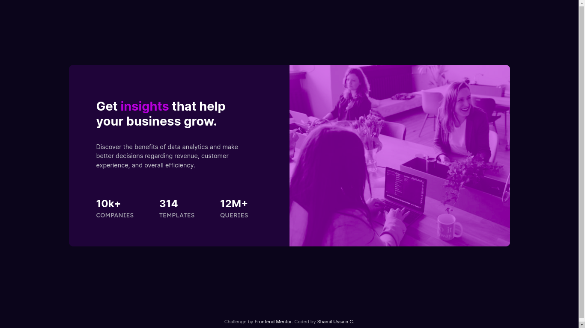

# Frontend Mentor - Stats preview card component solution

This is a solution to the [Stats preview card component challenge on Frontend Mentor](https://www.frontendmentor.io/challenges/stats-preview-card-component-8JqbgoU62). Frontend Mentor challenges help you improve your coding skills by building realistic projects. 

## Table of contents

- [Overview](#overview)
  - [The challenge](#the-challenge)
  - [Screenshot](#screenshot)
  - [Links](#links)
- [My process](#my-process)
  - [Built with](#built-with)
  - [Continued development](#continued-development)
- [Author](#author)

## Overview
Here is my 4th Frontend Mentor project. A Stats preview card component with responsive layout.

### The challenge

Users should be able to:

- View the optimal layout depending on their device's screen size

### Screenshot

### Links

<!-- - Solution URL: [Add solution URL here](https://your-solution-url.com) -->
- Live Site URL: [https://shamilussainc.github.io/Stats-preview-card-component/](https://shamilussainc.github.io/Stats-preview-card-component/)

## My process

- First developed html body structure
- Started building with mobile first approach
- Used Sass to create css file
- Used grid and media query for layout management.
- Used flexbox for alignment

### Built with

- Semantic HTML5 markup
- CSS custom properties
- Flexbox
- CSS Grid
- Mobile-first workflow

### Continued development

In this project grid layout fount useful when aligning elements besides normal html stucture.

## Author

- Linkedin - [Shamil ussain c](https://www.linkedin.com/in/shamil-ussain-c-893282187/)
- Frontend Mentor - [@shamilussainc](https://www.frontendmentor.io/profile/shamilussainc)
- Twitter - [@c_ussain](https://twitter.com/c_ussain)
